# 모델링

## 0. YOLO 선택 이유
- 순방향 패스로 속도가 빨라 실시간 객체 감지에 적합
- 같은 순방향 패스인 SSD에 비해 단순한 구조를 가지며, 더 적은 양의 데이터로 학습 가능 
## 1. 1차 모델링
- 1차 전처리 방법 사용
- 주차장 라인과 킥보드의 바운딩 박스를 각각 설정하여 주차장과 킥보드의 관계가 제대로 학습되지 않음 
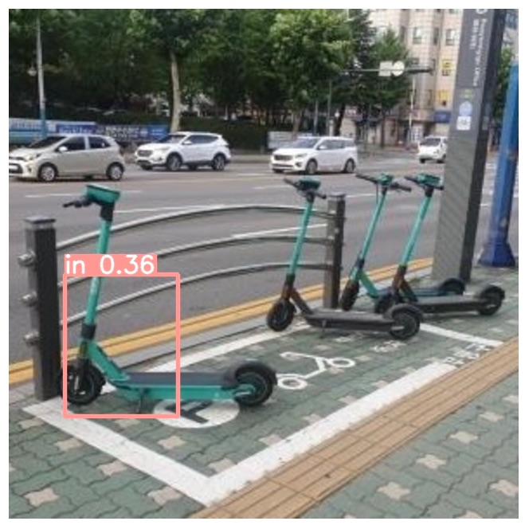
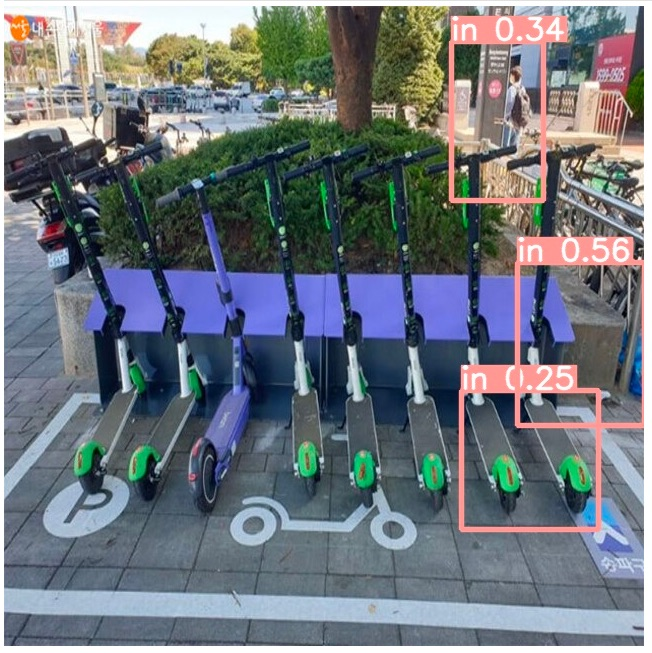
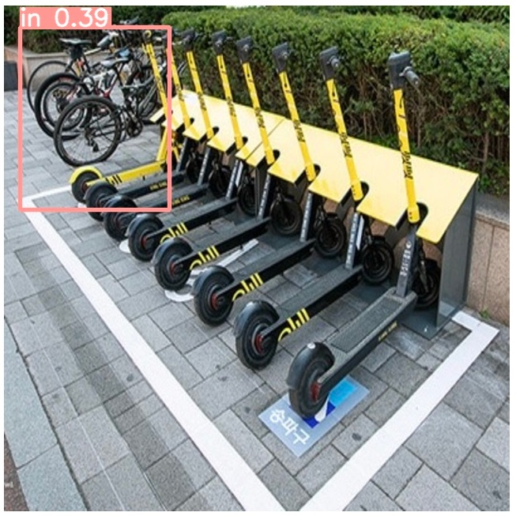

## 2. 2차 모델링
- YOLOv8 사용
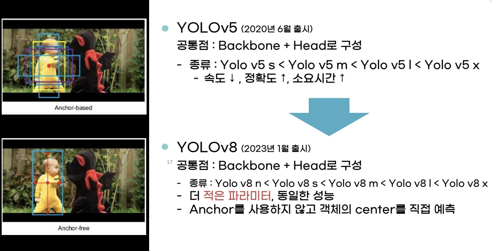
- 2차 전처리 방법 사용
- 주차장 라인과 킥보드를 함께 잡아 주차장과 킥보드 관계가 학습됨
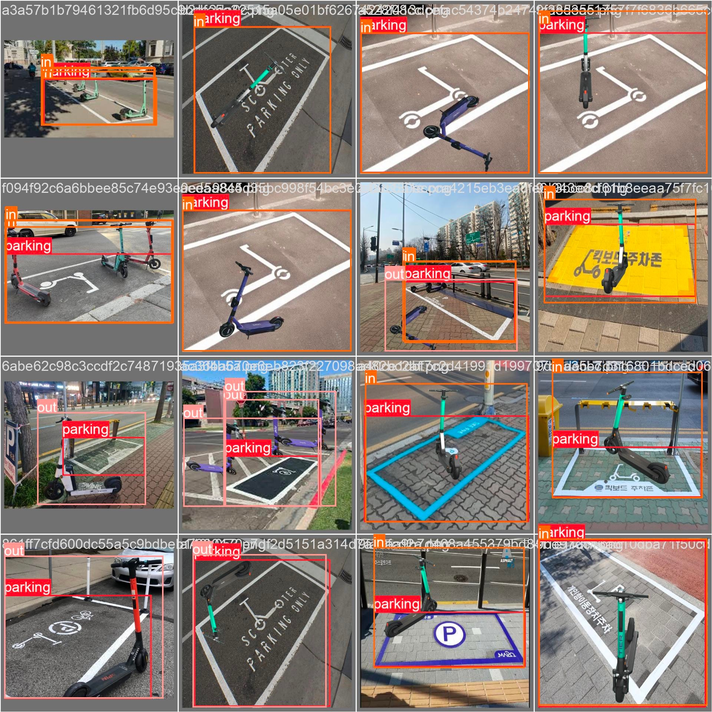
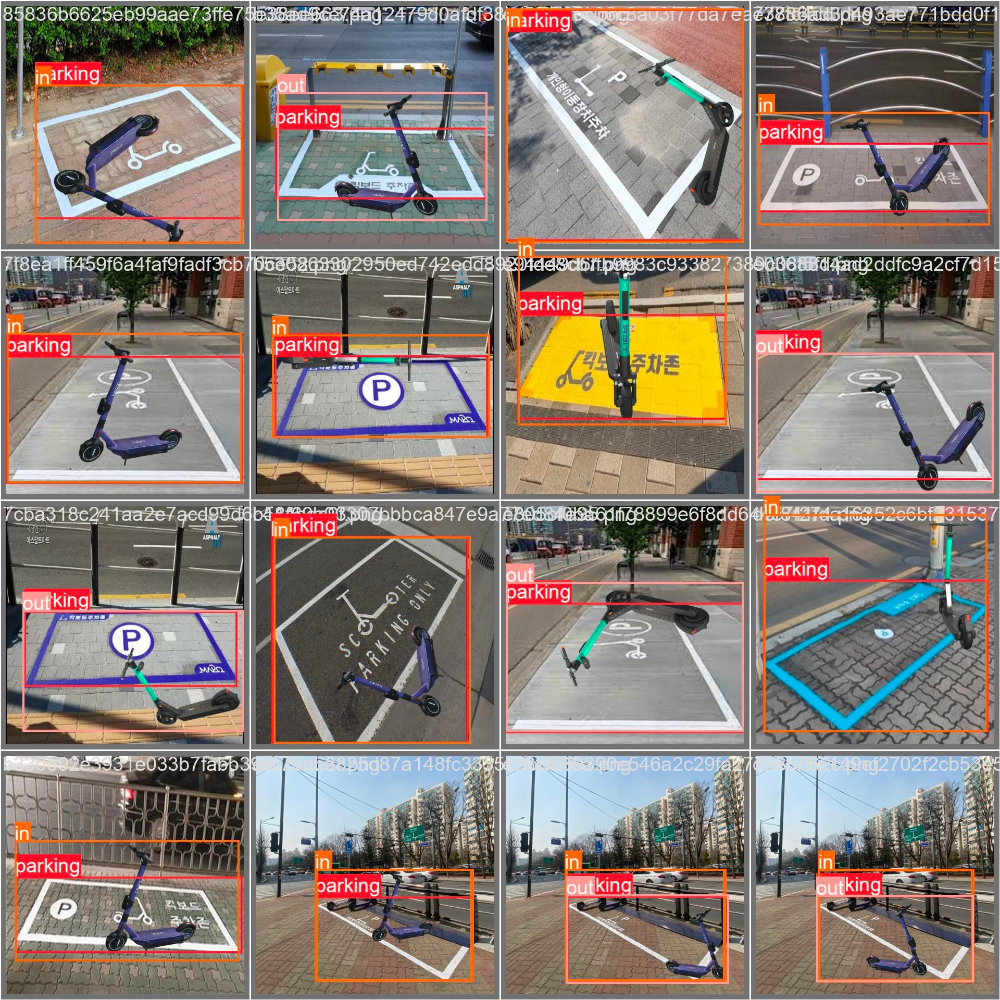

## 3. 3차 모델링
- 2차 & 3차 전처리 방법 사용
- in/out 학습모델과 stand/fall 학습모델 2가지를 함께 사용
- 킥보드의 주차형태를 4가지로 구분 가능
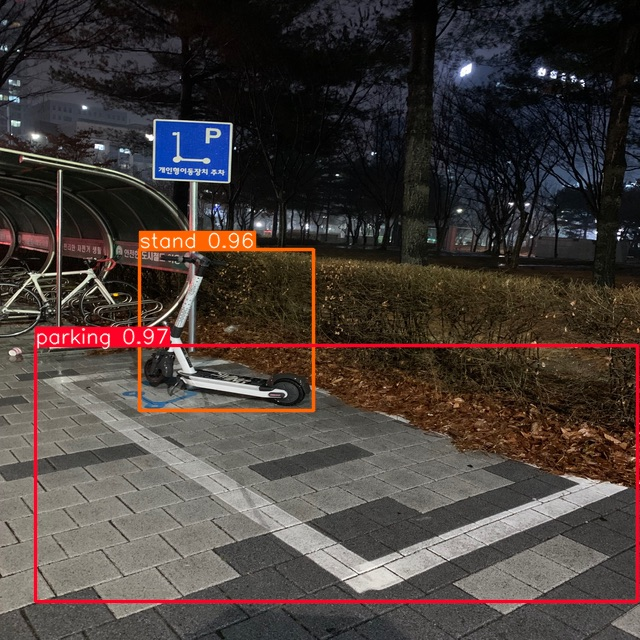
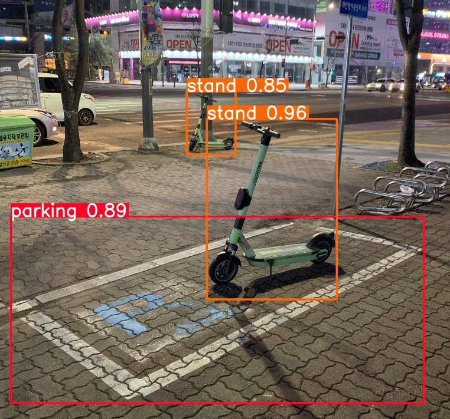
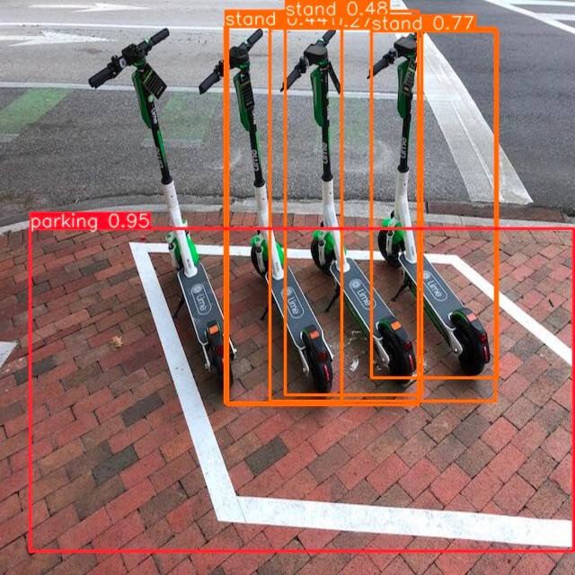

## 4. 4차 모델링
- 4차 전처리 방법 사용
- 킥보드 바퀴와 주차장의 겹침 정도에 따른 점수 부여를 위해 segmentation 사용 
- 마스크를 추출했으나, 서로 다른 객체의 마스크가 중첩되지 않아 겹침정도를 파악할 수 없음
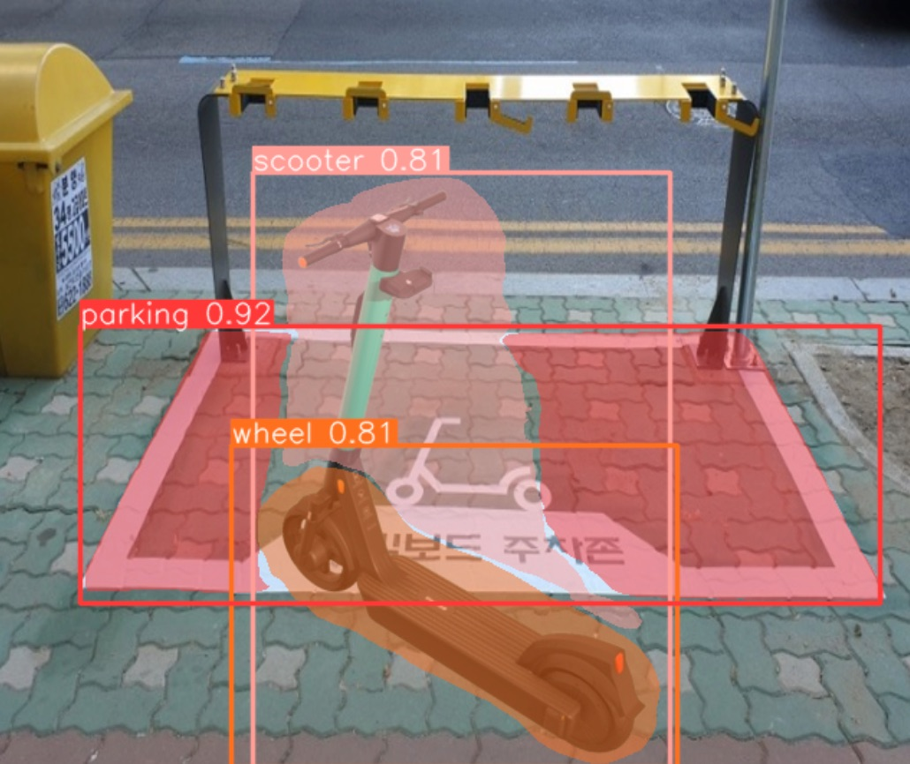

## 5. 5차 모델링 
- 4차 전처리 방법 사용
- YOLOv8(객체 바운딩박스)+ Mask-RCNN(객체 마스크)
- 바운딩박스 범위 내에 있는 마스크를 추출해 정확도 높임
- 킥보드 바운딩박스의 가로세로 길이를 이용해 킥보드의 쓰러짐 여부 판단
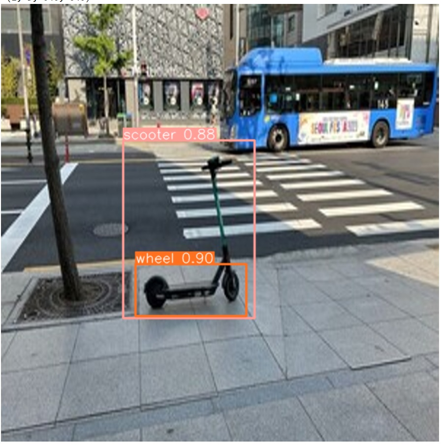
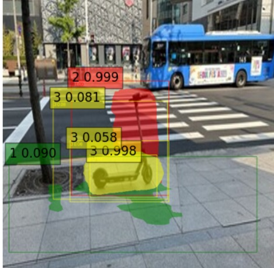

## 6. 모델링 결과
- 킥보드 휠과 주차장의 겹침 정도를 계산해 점수 차등부여
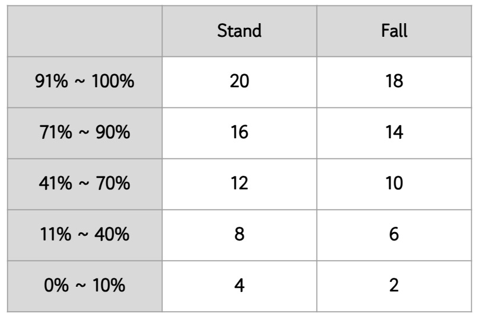
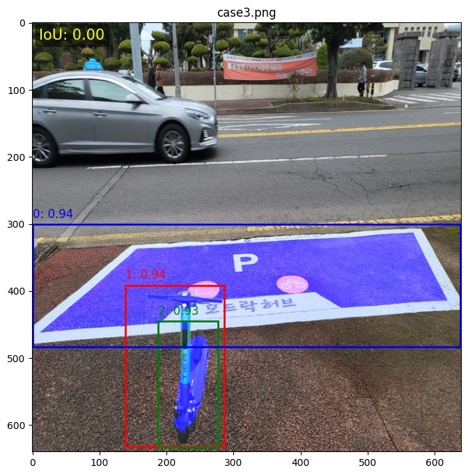
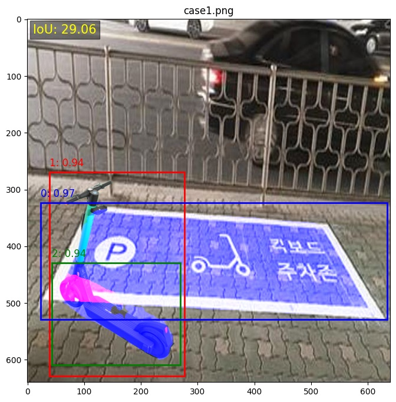
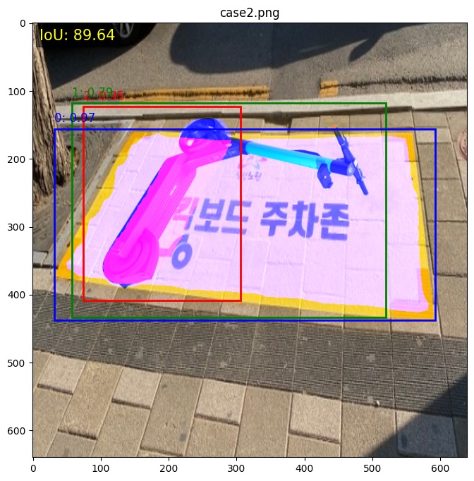
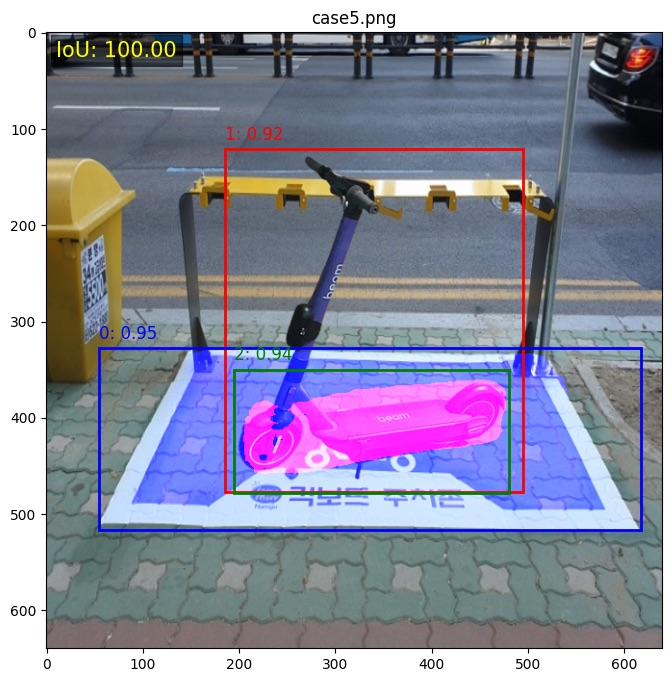