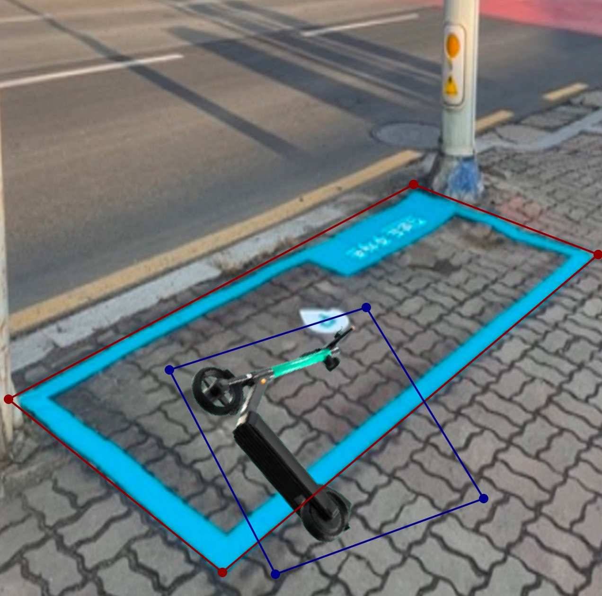
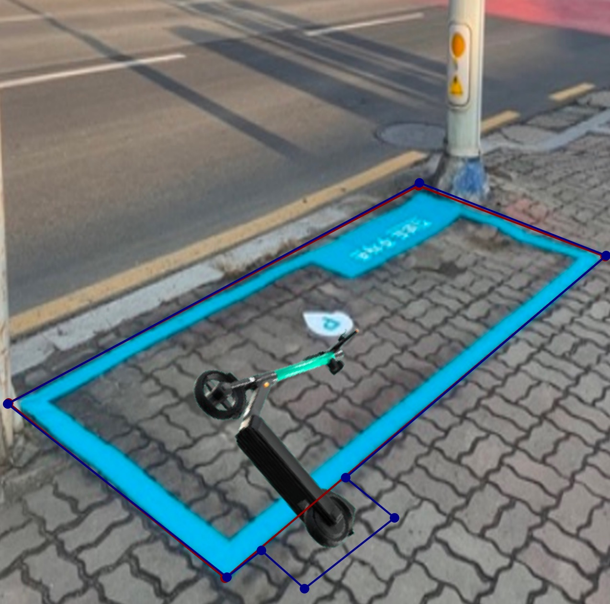
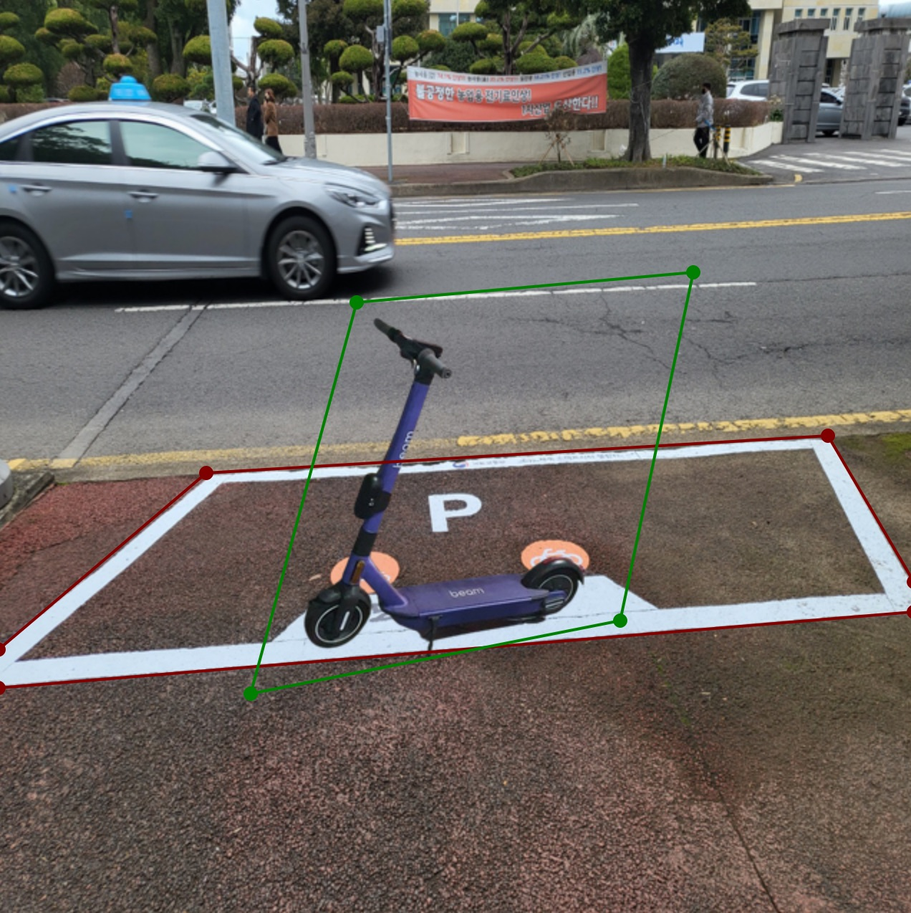
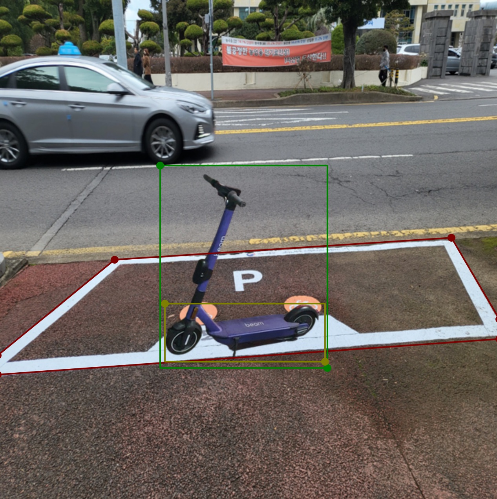

# 이미지 전처리

## 1. 1차 전처리

***주차장과 킥보드의 바운딩박스를 각각 설정***
- `parking`: 킥보드 주차장 라인
- `in`: 주차장 안에 주차된 킥보드
- `out`: 주차장 밖에 주차된 킥보드

## 2. 2차 전처리

***주차장과 킥보드 관계를 위해 바운딩박스를 겹치게 설정***
- `parking`: 킥보드 주차장 라인
- `in`: 주차장 안에 주차된 킥보드
- `out`: 주차장 밖에 주차된 킥보드

## 3. 3차 전처리

***킥보드 쓰러짐 여부를 확인하기 위해 stand/fall 구분***
- `parking`: 킥보드 주차장 라인
- `stand`: 세워진 킥보드
- `fall`: 쓰러진 킥보드

## 4. 4차 전처리

***킥보드 바퀴와 주차장의 겹침정도에 따라 점수를 차등부여하기 위해 wheel 추가***
- `parking`: 킥보드 주차장 라인
- `scooter`: 킥보드
- `wheel`: 킥보드 바퀴

