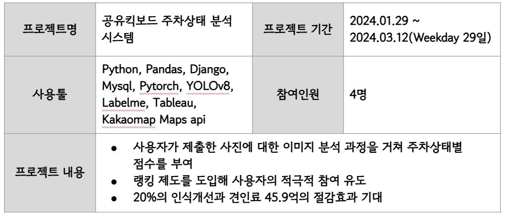
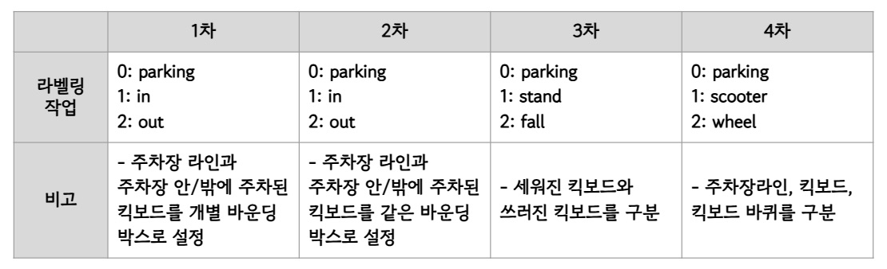
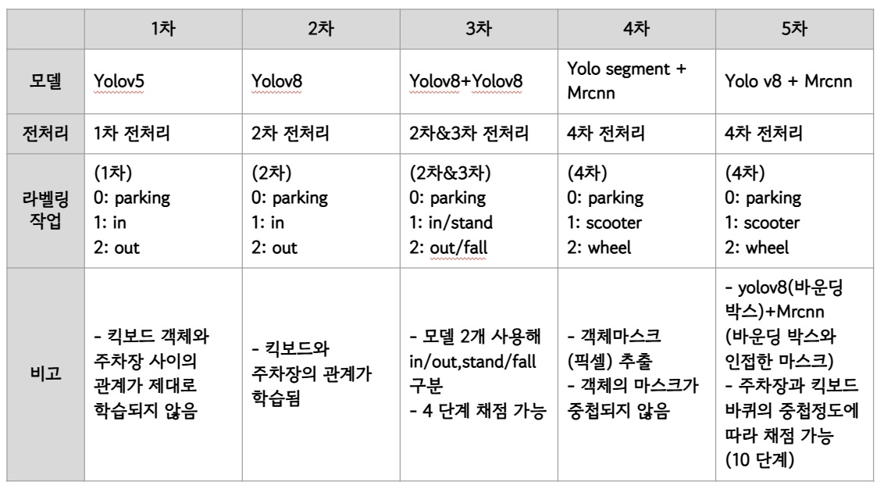
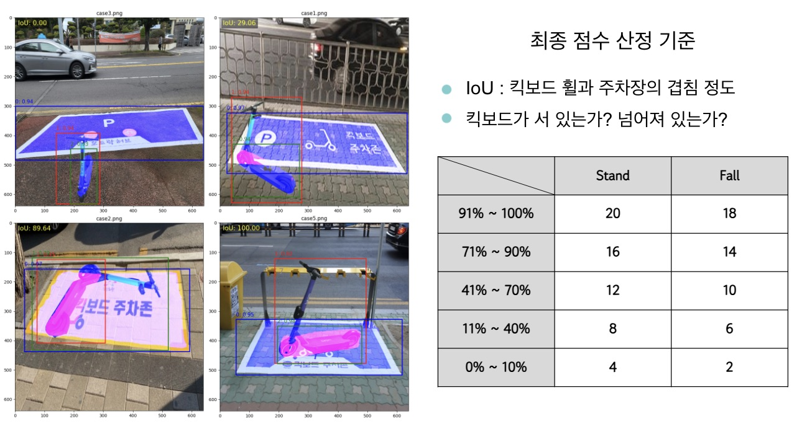
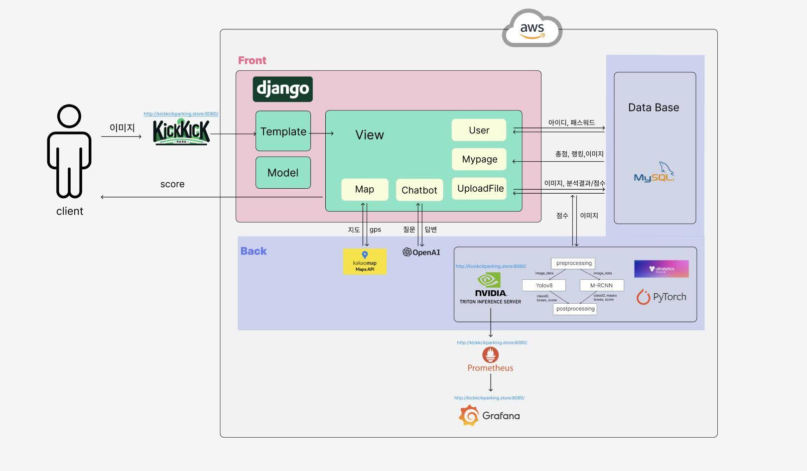
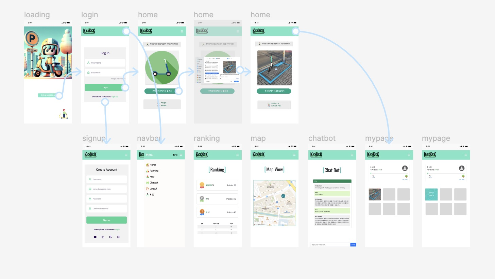

## 1. 프로젝트요약

## 2. 프로젝트 배경 및 목표 
### 2-1. 배경
- 공유킥보드의 입지가 성장하고 있으나, 무분별한 주차문제로 시민들의 부정적 인식이 높아짐
- 주차 문제를 해결할 수 있으면서 사용자들이 적극적으로 참여할 수 있는 방법이 필요함

### 2-2. 목표 
- 초기 목표: 주차장 수가 턱없이 부족하단 사실에서 공유 킥보드 최적 주차장 입지 선정 모델 개발
    - 유동인구, 시설, PM, 기타 카테고리로 나누고 점수를 차등부여해 상위 지역구 및 행정동 선정 -> `주차장 입지선정과 킥보드 주차율 개선의 직접적인 관련성을 찾기 어려워 이미지 분석으로 방향 변경` 
- 변경 후 목표: 사용자로부터 이미지를 입력받아 주차상태를 분석하고, 상태에 따른 점수를 부여해 홈페이지로 반환하는 모델 개발

## 3. 프로젝트 단계별 내용
### 3-1. 데이터 수집 
- 데이터 증강으로 킥보드 이미지 생성해 제작한 데이터셋 사용  
### 3-2. 데이터 전처리

### 3-3. 모델링
#### 3-3-1. 모델링 요약

#### 3-3-2. 최종 모델 결과 및 점수 기준
- 주차장라인, 킥보드, 킥보드 바퀴 추출
- 주차장라인과 킥보드 바퀴가 겹치는 면적 계산(IoU)
- 킥보드 바운딩박스의 가로세로 길이를 비교해 쓰러짐 여부 확인

### 3-4. 서비스
#### 3-4-1. 아키텍처

#### 3-4-2. 구성
- 프론트엔드(Front-end)
    - 회원가입(sign up)
    - 로그인 및 로그아웃(log in/out)
    - 반납 킥보드 사진촬영(camera)
    - 마이페이지(my page)
- 백엔드(Back-end)
    - 유저 정보 관리(DB)
    - 이미지 분석을 통한 점수 부여(score)
    - 사용자 위치 기반 지도(map)
    - Grafana 모니터링

#### 3-4-3. Mockup

### 3-5. 서버

### 4. 결과 및 기대효과
