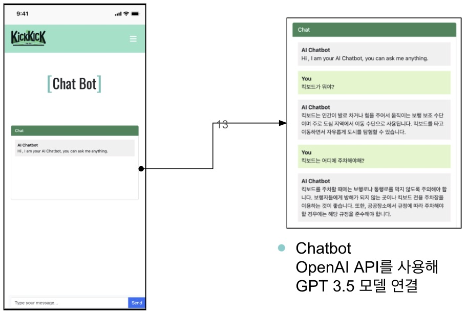

서비스
# 1. 서비스 아키텍처

# 2. Mockup

# 3. Log in/Sign up
- 로그인 및 회원가입

# 4. Home
- 홈 화면

# 5. Ranking
- 사용자들의 점수를 이용한 랭킹페이지

# 6. Map
- 사용자 위치 기반의 지도화면

# 7. Chatbot
- 챗봇화면 

# 8. Mypage
- 사용자의 총점 확인 가능
- 업로드 했던 사진 및 반납 정보 확인 가능

